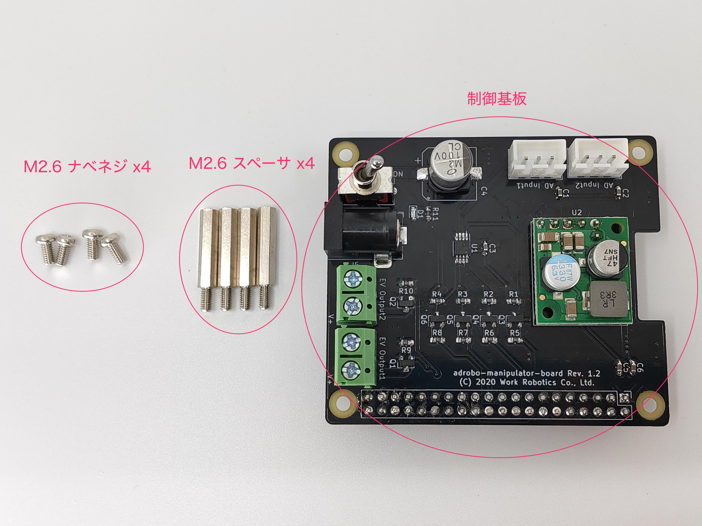
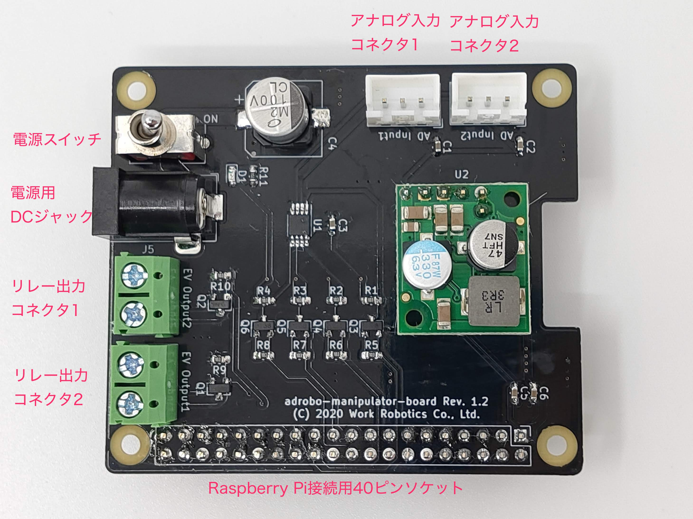
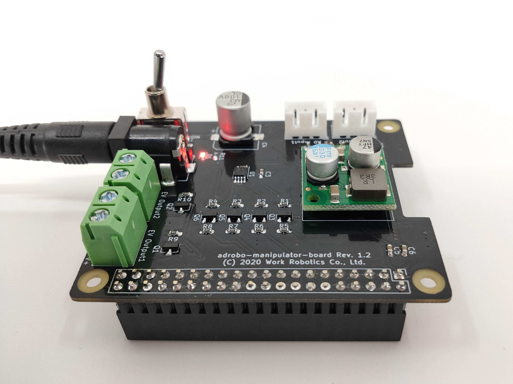
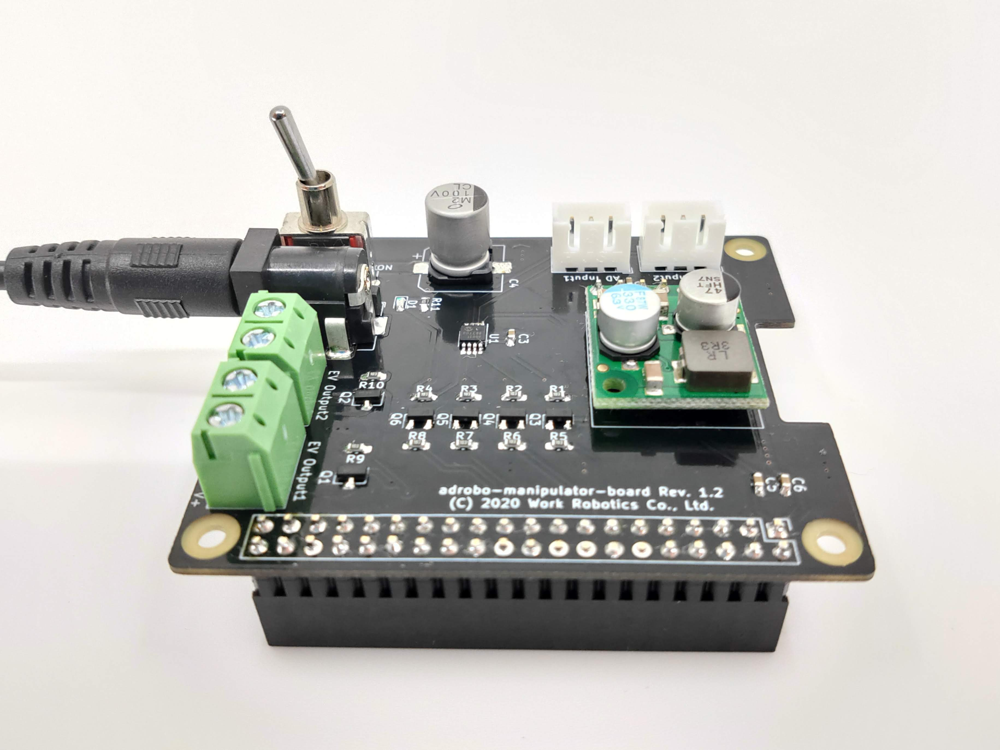
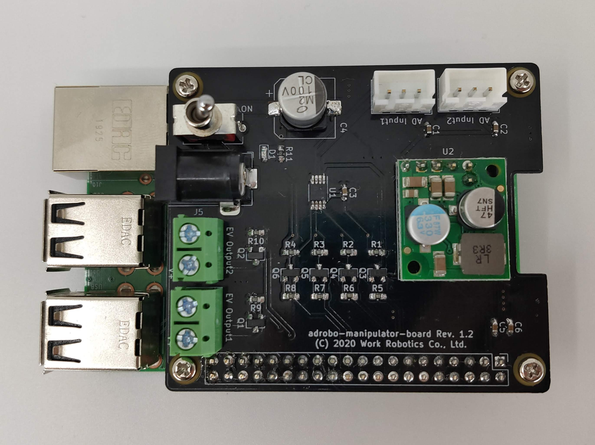
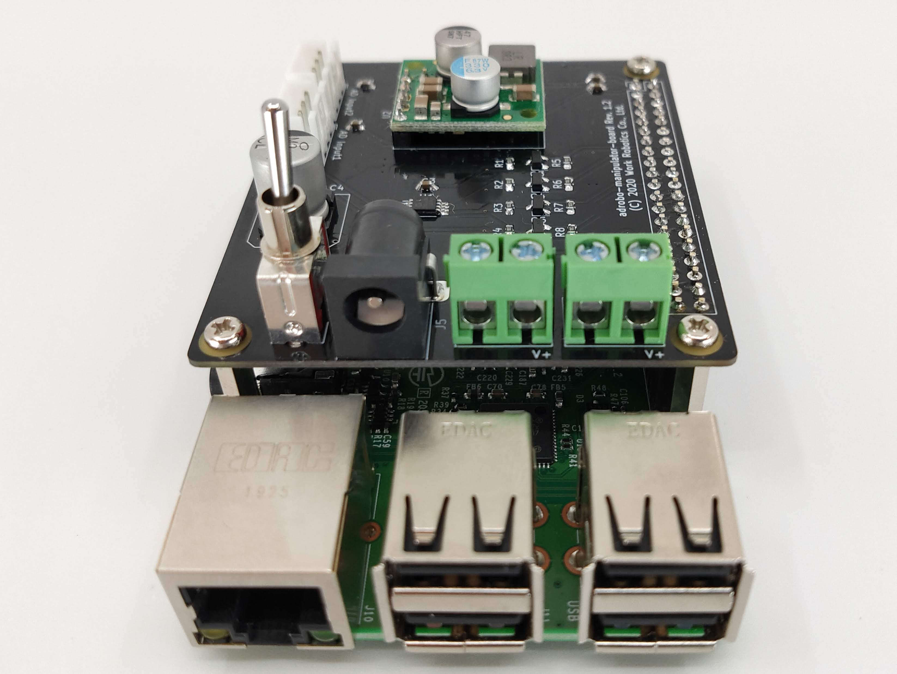
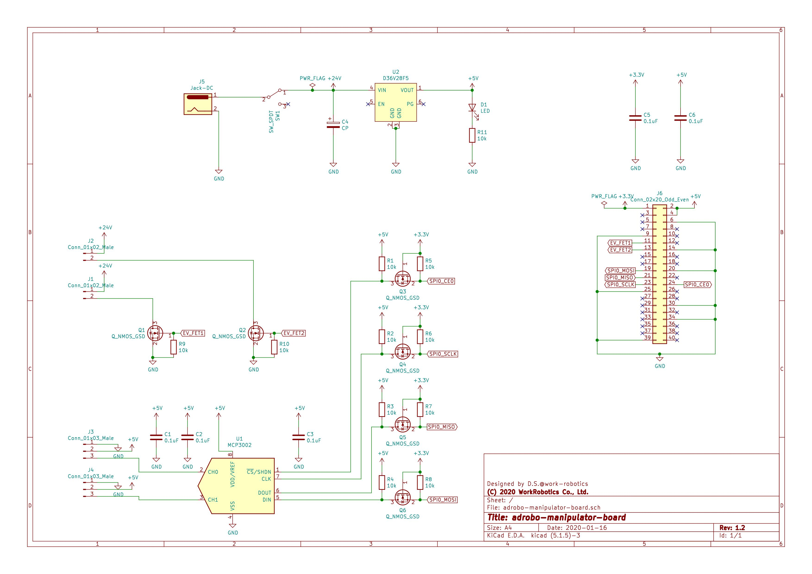

# adrobo-manipulator-board

本ページはadrobo-manipulator-board（以下、本製品と呼びます）の取り扱いマニュアルです。  
本ページに記載されている画像、会社名、製品名などの固有名詞は各社の登録商標または商標です。本文中では、TM、(R)マークは省略しています。

## サポートについて

本製品は出荷時に本書の「インターフェースについて」の章にて説明している機能について動作確認をした上で出荷しています。  
本製品を使用して生じた怪我や問題につきまして、株式会社ワークロボティクス（以下、弊社と呼びます）は一切保証いたしかねます。

## 内容物について

本製品は

* 制御基板
* M2.6 スペーサ（[BSB-2616.5-3E](http://hirosugi.co.jp/products/B/BSB-E.html)）
* M2.6 ナベネジ（[B-2605](https://www.hirosugi-net.co.jp/shop/g/g36579/)）

を同梱しています。開封時にあらかじめご確認ください。

制御基板の2020年2月現在の最新版はRev. 1.2です。

スペーサについては
M2.5のスペーサを利用したい場合は別途用意してください。  
M2.6の高さ16.5mmのものを選定していますが、
16.0mmのものでも問題ないと思います。

## 推奨環境

本製品の推奨電源電圧は24Vです。  
本製品はRaspbian BusterをインストールしたRaspberry Pi 3 Model B+にて動作確認をしています。  
動作確認に際しては以下の機能を[raspi-config](https://www.raspberrypi.org/documentation/configuration/raspi-config.md)を用いて有効にしています。

* SSH
* SPI
* Remote GPIO

## 各部名称

本製品の各部名称は次の図の通り、それぞれ

* 電源スイッチ
* 電源用DCジャック
* リレー出力コネクタ1
* リレー出力コネクタ2
* アナログ入力コネクタ1
* アナログ入力コネクタ2
* Raspberry Pi接続用40ピンソケット

とします。

## 各インターフェースの使用方法

本製品には以下の5種類のインターフェースがあります。

* 電源スイッチ
* 電源用DCジャック
* リレー出力コネクタ
* アナログ入力コネクタ
* Raspberry Pi接続用40ピンソケット

それぞれのインターフェースについて説明します。

### 電源スイッチ

制御基板の電源をON/OFFするためのスイッチです。  
このスイッチの操作により、制御基板につながるRaspberry Pi、リレー出力コネクタ、アナログ入力コネクタへの電源供給状態を切り替えできます。

電源スイッチのON/OFFにより電源スイッチ横のLEDが点灯/消灯します。

### 電源用DCジャック

内径2.1mm、外径5.5mmのセンタープラスの標準DCジャックです。制御基板に直流24Vの電源を供給する際に用います。  
Raspberry Piへ安定して電源を供給するためには、電圧は24Vで電流は3A以上の電源の使用を推奨します。

### リレー出力コネクタ

リレーや電磁弁のスイッチングのためのコネクタです。「EV Output1」「EV Output2」と基板には記載されています。  
「EV Output1」と書かれたリレー出力コネクタ1はRaspberry PiのGPIO17、
「EV Output2」と書かれたリレー出力コネクタ2はRaspberry PiのGPIO27
の操作により出力状態を切り替えることができます。

### アナログ入力コネクタ

センサ値をアナログ電圧として出力するセンサ信号を入力するためのコネクタです。「AD Input1」「AD Input2」と基板には記載されています。  
Raspberry PiのSPI0に接続されたADコンバータ（[MCP3002](https://www.microchip.com/wwwproducts/en/MCP3002)）経由で電圧を取得します。  
「AD Input1」と書かれたアナログ入力コネクタ1はADコンバータのCH0に、
「AD Input2」と書かれたアナログ入力コネクタ2はADコンバータのCH1に
接続されています。

### Raspberry Pi接続用40ピンソケット

Raspberry Piへ接続するためのピンソケットです。  
このピンソケットを経由して

* Raspberry Piへの電源供給
* ADコンバータとRaspberry Piの通信
* リレースイッチング回路の駆動

を行います。

以下の図のように制御基板電源スイッチとRaspberry PiのUSBポートが同じ側に来るように接続します。

## 回路図

制御基板の回路図は以下のリンクからダウンロードできます。

[回路図PDF](./images/adrobo-manipulator-board_sch.pdf)

(C) 2020 Work Robotics Co., Ltd.
